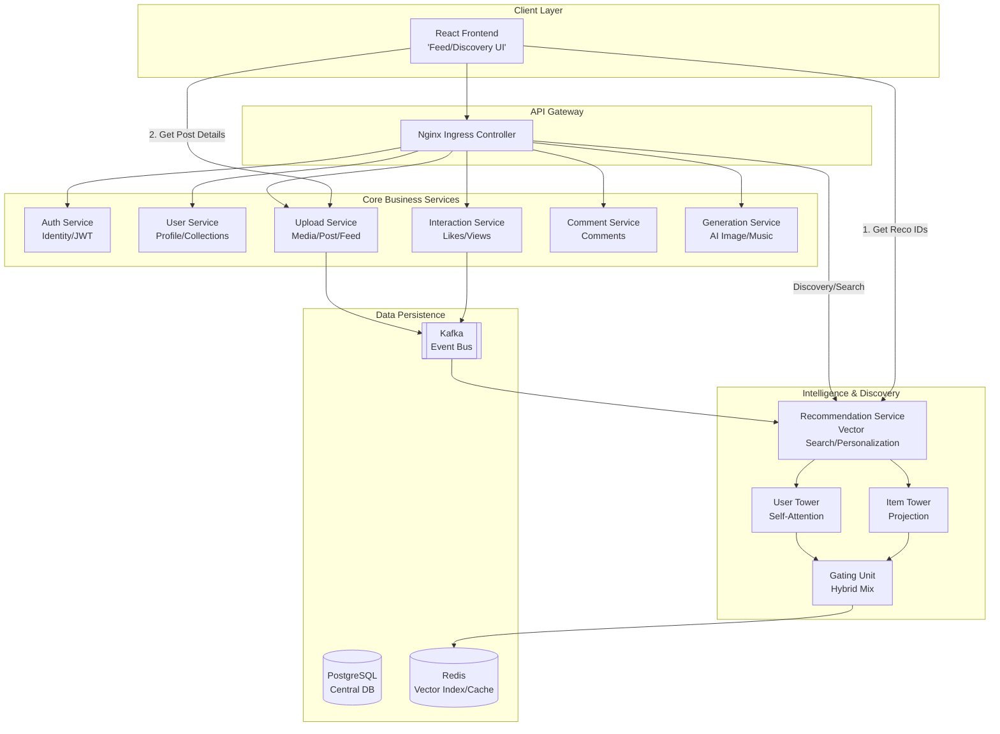

# Insterest Architecture

Insterest(Inspirational Interest)는 AI 기반의 멀티모달 콘텐츠 생성 및 추천 플랫폼입니다.

## 🏗 전체 시스템 구조 (High-Level Architecture)

## 🧠 추천 시스템 (Unified Intelligence)

Insterest의 핵심은 사용자의 의도(Query)와 취향(User Preference)을 다차원적으로 이해하는 추천 엔진입니다.

### 1. Dual-Tower & Multimodal Fusion
시스템은 두 개의 핵심 타워와 융합 레이어로 구성됩니다.

*   **User Tower:** 사용자의 최근 상호작용(좋아요, 저장) 이력을 기반으로 취향을 임베딩합니다.
    *   `Multihead Attention`: 상호작용 간의 중요도를 가중치로 계산.
    *   `GRU`: 단기적인 취향 변화 및 시퀀스 정보 포착.
    *   `Residual Mean Pool`: 장기적인 취향 정보 유지.
*   **Item Tower (Multimodal):** 콘텐츠의 다양한 속성을 128차원의 통합 벡터 공간으로 투영합니다.
    *   `Caption & Hashtag (NLP)`: BERT 기반 768차원 벡터를 128차원으로 MLP Projection.
    *   `Image (Visual)`: CLIP/ResNet 기반 512차원 벡터를 128차원으로 MLP Projection.
    *   `Fusion MLP`: 여러 모달리티의 벡터를 결합하여 최종적인 아이템 임베딩 생성.

### 2. 128차원 통합 프로젝션 공간 (Unified Space)
모든 데이터(텍스트, 이미지, 유저 취향, 검색어)는 최종적으로 동일한 **128차원 벡터 공간**에서 표현됩니다.
*   **ANN Search**: Redis Stack의 HNSW 인덱스를 사용하여 대규모 데이터셋에서도 밀리초 단위의 KNN 검색이 가능합니다.
*   **Cosine Similarity**: 각 벡터는 L2 Normalization을 거쳐 코사인 유사도 기반으로 매칭됩니다.

### 3. Discovery Interaction Fusion
단순한 가중합 방식이 아닌, 딥러닝 기반의 상호작용 융합을 사용하여 최적의 검색 및 추천 결과를 도출합니다.
*   **Fusion Logic**: $v = q + u + (q \times u)$
    *   $q$: 검색어(Query) 임베딩
    *   $u$: 유저 취향(User Context) 임베딩
    *   검색어와 유저 취향의 요소별 곱(Hadamard Product)을 더해 두 정보 간의 상호작용을 극대화합니다.

### 4. 추천 데이터 흐름 (Recommendation Data Flow)
1.  **Ingestion**: `Upload Service`에서 게시물이 생성되면 `Kafka`를 통해 `Recommendation Service`로 이벤트가 발행됩니다.
2.  **Projection**: 수신된 멀티모달 벡터를 128차원으로 투영하여 **Redis (HNSW)**에 실시간 인덱싱합니다.
3.  **Context Fetching**: 추천 요청 시 `Interaction Service`로부터 사용자의 최근 이력을 가져와 실시간으로 `User Vector`를 생성합니다.
4.  **Retrieval**: 생성된 `Target Vector`를 기반으로 Redis에서 가장 유사한 포스트 ID를 검색합니다.
5.  **Continuous Learning**: 매일 수집된 데이터를 바탕으로 Modality Dropout 기법을 적용하여 모델을 재학습(Self-supervised learning)합니다.

## 🛠 서비스 구성 요소 (Microservices)

현재 시스템은 총 **7개의 백엔드 서비스**와 **1개의 프론트엔드 서비스**로 구성되어 있습니다.

| 서비스명 | 포트 | 주요 역할 |
| :--- | :--- | :--- |
| **Frontend** | 80 | React 기반 웹 인터페이스, 메인 피드 및 탐색 UI |
| **Auth Service** | 8000 | 사용자 인증, JWT 발급, 소셜 로그인 |
| **Upload Service** | 8001 | 미디어 업로드, 게시물(Post) 관리, 피드 데이터 제공 |
| **Generation Service** | 8002 | AI 이미지(Flux) 및 음악(MusicGen) 생성 |
| **Interaction Service** | 8004 | 좋아요, 조회수 등 사용자 인터렉션 처리 |
| **Comment Service** | 8005 | 게시물 댓글 관리 |
| **User Service** | 8006 | 프로필 관리, 개인화 컬렉션(저장함) |
| **Recommendation Service** | 8008 | 벡터 검색 기반 추천 엔진, 검색 및 탐색 결과 제공 |

## 🔄 데이터 흐름 (Data Flow)

1.  **콘텐츠 생성:** 사용자가 `Generation Service`를 통해 AI 콘텐츠를 생성하고, `Upload Service`를 통해 게시합니다.
2.  **이벤트 수집:** 게시물 생성 및 좋아요 등의 활동은 `Kafka`를 통해 `Recommendation Service`로 전달됩니다.
3.  **추천 및 검색:** `Recommendation Service`는 사용자 패턴을 분석하여 개인화된 게시물 ID 목록을 제공합니다.
4.  **피드 렌더링:** 프론트엔드는 추천받은 ID를 바탕으로 `Upload Service`에서 상세 정보를 조회하여 화면에 출력합니다.
