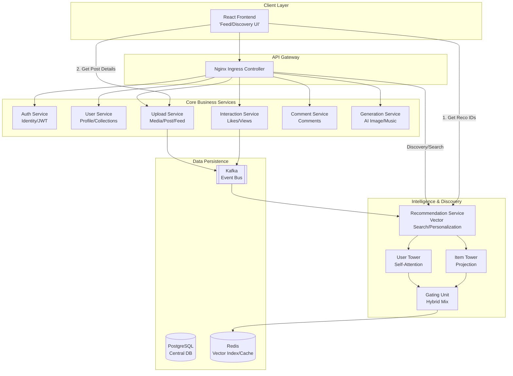

# Insterest Architecture

Insterest(Inspirational Interest)는 AI 기반의 멀티모달 콘텐츠 생성 및 추천 플랫폼입니다.

## 🏗 전체 시스템 구조 (High-Level Architecture)

## 🛠 서비스 구성 요소 (Microservices)

현재 시스템은 총 **7개의 백엔드 서비스**와 **1개의 프론트엔드 서비스**로 구성되어 있습니다.

| 서비스명                   | 포트 | 주요 역할                                          |
| :------------------------- | :--- | :------------------------------------------------- |
| **Frontend**               | 80   | React 기반 웹 인터페이스, 메인 피드 및 탐색 UI     |
| **Auth Service**           | 8000 | 사용자 인증, JWT 발급, 소셜 로그인                 |
| **Upload Service**         | 8001 | 미디어 업로드, 게시물(Post) 관리, 피드 데이터 제공 |
| **Generation Service**     | 8002 | AI 이미지(Flux) 및 음악(MusicGen) 생성             |
| **Interaction Service**    | 8004 | 좋아요, 조회수 등 사용자 인터렉션 처리             |
| **Comment Service**        | 8005 | 게시물 댓글 관리                                   |
| **User Service**           | 8006 | 프로필 관리, 개인화 컬렉션(저장함)                 |
| **Recommendation Service** | 8008 | 벡터 검색 기반 추천 엔진, 검색 및 탐색 결과 제공   |

## 🔄 데이터 흐름 (Data Flow)

1.  **콘텐츠 생성:** 사용자가 `Generation Service`를 통해 AI 콘텐츠를 생성하고, `Upload Service`를 통해 게시합니다.
2.  **이벤트 수집:** 게시물 생성 및 좋아요 등의 활동은 `Kafka`를 통해 `Recommendation Service`로 전달됩니다.
3.  **추천 및 검색:** `Recommendation Service`는 사용자 패턴을 분석하여 개인화된 게시물 ID 목록을 제공합니다.
4.  **피드 렌더링:** 프론트엔드는 추천받은 ID를 바탕으로 `Upload Service`에서 상세 정보를 조회하여 화면에 출력합니다.
