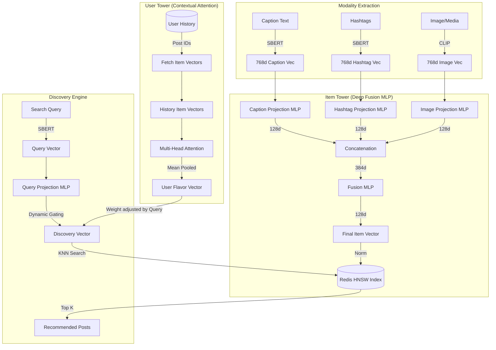

# Recommendation System Architecture

이 문서는 `recommendation_service`의 멀티모달 기반 추천 및 탐색 시스템 아키텍처를 설명합니다.

## 1. 개요
본 시스템은 **SBERT(텍스트)**와 **CLIP(이미지)** 임베딩을 결합한 **Deep Fusion MLP** 구조를 사용합니다. 유저의 취향(User Tower)과 검색 의도(Query)를 128차원의 잠재 공간(Latent Space)에서 통합하여 실시간 추천을 제공합니다.

## 2. 아키텍처 다이어그램

## 3. 핵심 컴포넌트

### 3.1. Item Tower (Deep Fusion)
*   **Multi-modal Embedding:** 캡션(SBERT), 해시태그(SBERT), 이미지(CLIP) 정보를 각각 추출합니다.
*   **Projection Layer:** 768/512차원의 원본 벡터를 128차원의 특징 공간으로 개별 투영합니다.
*   **Deep Fusion:** 세 모달리티를 결합(Concatenate)한 후 2계층 MLP를 통과시켜 상호 연관성을 학습합니다.
*   **Redis Vector DB:** 최종 128차원 벡터를 HNSW 인덱스에 저장하여 초고속 근사 검색(ANN)을 수행합니다.

### 3.2. User Tower (Attention-based)
*   **History Encoding:** 사용자가 최근 상호작용한 포스트들의 특징 벡터 시퀀스(최대 20개)를 입력으로 받습니다.
*   **Contextual Attention:** Multi-head Attention을 통해 유저가 최근 집중하고 있는 관심사를 동적으로 추출합니다.
*   **User Flavor Vector:** 유저의 현재 고유 취향을 나타내는 128차원 정규화 벡터입니다.

### 3.3. Discovery Engine & Dynamic Gating
*   **Vector Fusion:** `Discovery_Vector = Query + Gated_User + (Query * Gated_User)`
*   **Dynamic Gating:** 사용자가 검색어(Query)를 명확하게 입력한 경우(벡터의 Norm 값이 클 경우), 엉뚱한 결과가 나오지 않도록 유저 취향(User Vector)의 영향력을 `1 - tanh(query_intensity)` 공식을 이용해 동적으로 감소(차단)시킵니다.
*   **Distance Metric:** L2 Normalization 후 코사인 유사도 기반으로 Redis에서 가장 유사한 항목을 탐색합니다.

## 4. 모델 학습 알고리즘 (Continuous Training)
시스템은 별도의 정답 데이터(Label) 없이, 등록된 멀티모달 포스트 벡터들을 활용해 **자기 지도 학습(Self-Supervised Learning)**을 수행합니다.

*   **학습 환경:**
    *   **Epochs:** 50 (적은 데이터에서도 변별력을 갖추기 위해 에폭 수를 충분히 가져갑니다.)
    *   **Batch Size:** 32
    *   **Optimizer:** Adam (lr=1e-4, weight_decay=1e-5)
    *   **Data:** DB에 저장된 최근 포스트 벡터 최대 1,000개를 로드하여 학습.

*   **핵심 손실 함수 (Loss Functions):**
    1.  **InfoNCE Loss (Discovery):** 모델이 예측한 타겟 벡터와 실제 아이템 벡터를 매칭 (Temperature=0.05로 깐깐한 Hard Matching 유도).
    2.  **Query-Item Direct Alignment:** 검색어 벡터와 아이템 벡터의 다이렉트 매칭 (유저 맥락에 의해 검색어의 본질이 뭉개지지 않도록 방지).
    3.  **Query-Image Alignment (Multimodal CLIP-style):** 텍스트 검색어 벡터와 이미지 벡터를 직접 대조 학습. 이를 통해 텍스트에 없는 특징이더라도 "사이버펑크 느낌"과 같은 시각적 요소를 텍스트로 바로 검색할 수 있게 됩니다.
    4.  **Similarity Preservation (구조 유지):** 128차원으로 투영되는 과정에서 원본 768차원 공간(SBERT)의 의미론적 거리(유사도)가 붕괴되지 않도록 강제합니다.

## 5. 데이터 흐름
1.  **Indexing:** 새로운 포스트 생성 시 캡션/이미지 벡터 생성 → Deep Fusion → Redis 저장.
2.  **Discovery:** 유저 요청 → 유저 히스토리 기반 취향 벡터 생성 → 검색어 결합(Dynamic Gating) → Redis KNN 검색 → 결과 반환.
3.  **Training & Backfill:** 50 에폭의 자체 모델 재학습(`train_discovery_step`) 후, 새로운 가중치를 바탕으로 모든 게시물을 다시 128차원 공간으로 재생성(Backfill)하여 Redis를 갱신합니다.
