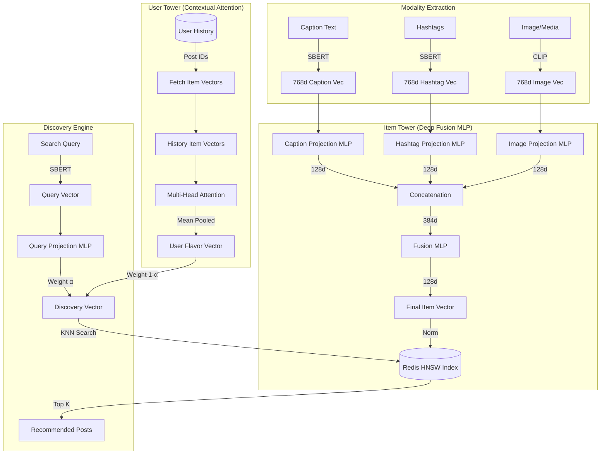

# Recommendation System Architecture

이 문서는 `recommendation_service`의 멀티모달 기반 추천 및 탐색 시스템 아키텍처를 설명합니다.

## 1. 개요
본 시스템은 **SBERT(텍스트)**와 **CLIP(이미지)** 임베딩을 결합한 **Deep Fusion MLP** 구조를 사용합니다. 유저의 취향(User Tower)과 검색 의도(Query)를 128차원의 잠재 공간(Latent Space)에서 통합하여 실시간 추천을 제공합니다.

## 2. 아키텍처 다이어그램

## 3. 핵심 컴포넌트

### 3.1. Item Tower (Deep Fusion)
*   **Multi-modal Embedding:** 캡션(SBERT), 해시태그(SBERT), 이미지(CLIP) 정보를 각각 추출합니다.
*   **Projection Layer:** 768차원의 원본 벡터를 128차원의 특징 공간으로 개별 투영합니다.
*   **Deep Fusion:** 세 모달리티를 결합(Concatenate)한 후 2계층 MLP를 통과시켜 상호 연관성을 학습합니다.
*   **Redis Vector DB:** 최종 128차원 벡터를 HNSW 인덱스에 저장하여 초고속 근사 검색(ANN)을 수행합니다.

### 3.2. User Tower (Attention-based)
*   **History Encoding:** 사용자가 최근 상호작용한 포스트들의 특징 벡터 시퀀스를 입력으로 받습니다.
*   **Contextual Attention:** Multi-head Attention을 통해 유저가 최근 집중하고 있는 관심사를 동적으로 추출합니다.
*   **User Flavor Vector:** 유저의 현재 고유 취향을 나타내는 128차원 정규화 벡터입니다.

### 3.3. Discovery Engine
*   **Vector Fusion:** `Discovery_Vector = α * Query + (1-α) * User_Flavor`
*   **α (Query Weight):** 검색어가 있을 경우 0.85, 없을 경우 0.0(순수 추천)으로 자동 조정됩니다.
*   **Distance Metric:** 코사인 유사도(Cosine Similarity)를 기반으로 Redis에서 가장 유사한 항목을 탐색합니다.

## 4. 데이터 흐름
1.  **Indexing:** 새로운 포스트 생성 시 캡션/이미지 벡터 생성 → Deep Fusion → Redis 저장.
2.  **Discovery:** 유저 요청 → 유저 히스토리 기반 취향 벡터 생성 → 검색어 결합 → Redis KNN 검색 → 결과 반환.
3.  **Continuous Learning:** 유저의 실제 클릭/좋아요 데이터를 기반으로 매일 밤 모델 가중치(MLP, Attention)를 미세 조정(Fine-tuning).
