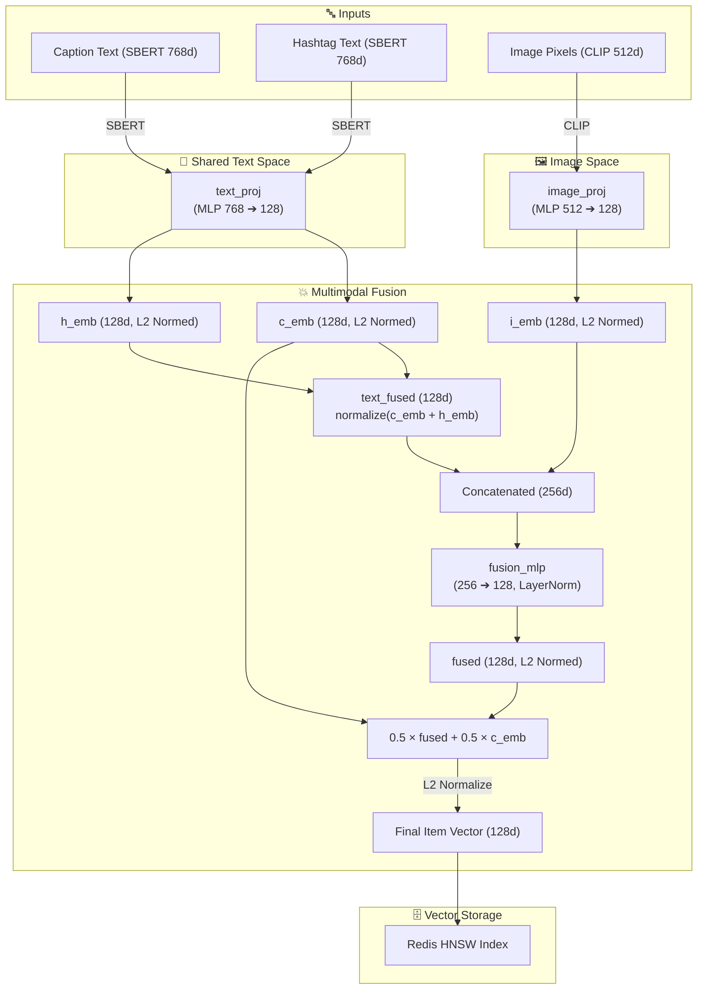
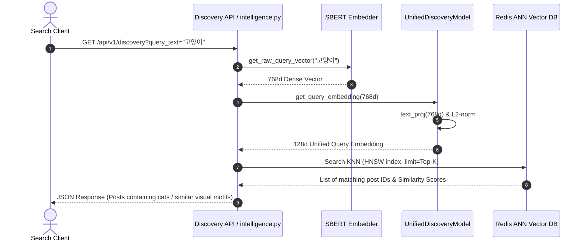
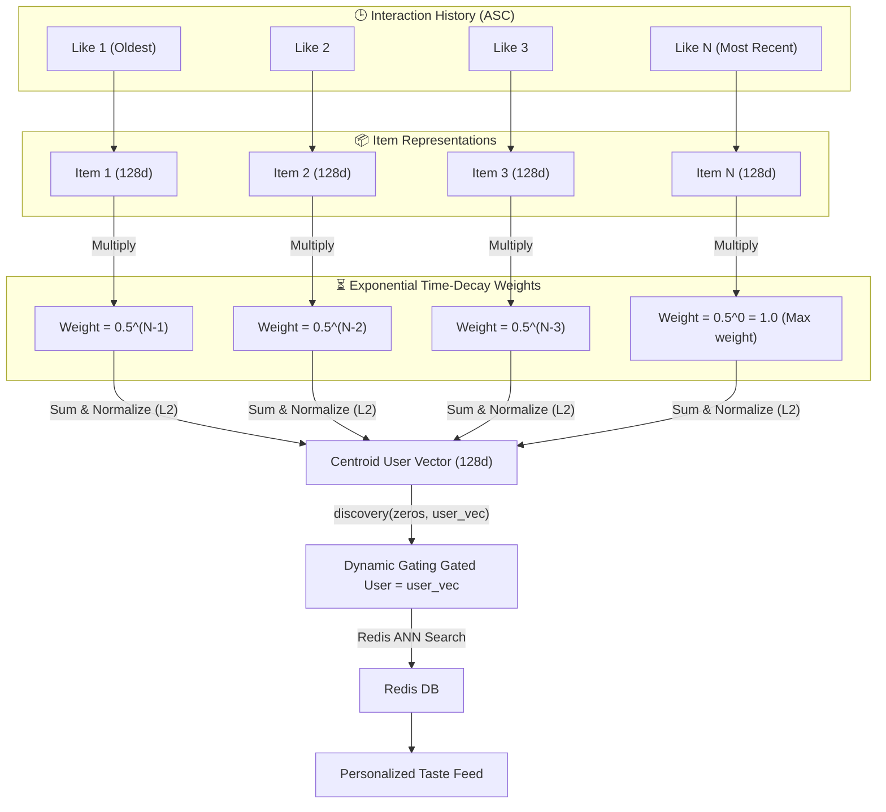
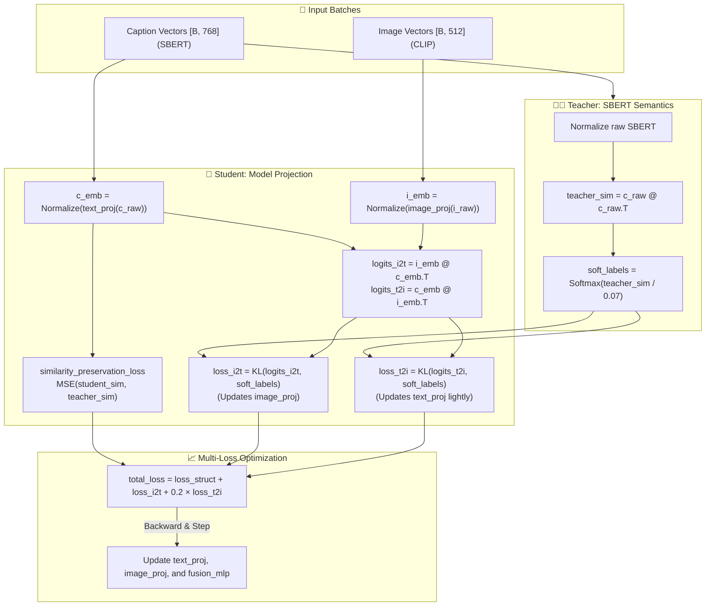

# Insterest Multimodal Recommendation Engine Architecture

This document defines the finalized production architecture of the **Insterest Multimodal Recommendation System**. The system is designed to resolve classical vector collapse and alignment problems by uniting all text projections under a shared weight, avoiding false negatives via SBERT-guided **Soft CLIP**, and establishing a robust baseline for recommendations through **Time-Decay Weighted Pooling**.

---

## 1. Unified Model Structure (UnifiedDiscoveryModel)

To guarantee that search queries, post captions, and hashtags always map to a mathematically consistent latent space, they share a single weight-projection layer (`text_proj`).

---

## 2. Pure Semantic Search (100% Query Search)

By completely bypassing the dynamic gating fusion loop when a user submits a search query, we ensure that searches are purely focused on semantic and thematic matches without any personalization bias distortion.

---

## 3. Personalized Recommendation Flow (Time-Decay Weighted Pooling)

Rather than using an untrained, sequence-distorting GRU model when likes data is sparse, the system maps user preferences using **Time-Decay Weighted Pooling**. The older a like interaction, the exponentially smaller its impact on the resulting user vector.

---

## 4. Phase 1 Training Pipeline: SBERT-Guided Bidirectional Soft CLIP

To align images and texts while preventing false negatives (e.g., classifying "Cat 1" and "Cat 2" in a batch as total opposites), the alignment loss is calculated against soft probabilities derived from SBERT similarity scores.

---

## 5. Architectural Comparison (Before vs. After Optimization)

| Feature | Before (Collapsed Space) | After (Aligned Stable Space) | Rationale |
|:---|:---|:---|:---|
| **Text Embedding Projection** | Separated `query_proj` & `caption_proj` | **Unified `text_proj`** | Guarantees search terms and post descriptions share the exact same coordinates by design. |
| **Hashtag Processing** | Separated `hashtag_proj` (untrained noise) | **Shared `text_proj` (averaged)** | Merges hashtag signals directly with caption semantics as a regularized text input. |
| **Image-Text Alignment** | Hard CLIP-style InfoNCE Loss | **SBERT-Guided Bidirectional Soft CLIP** | Solves False Negatives. batched duplicates (e.g., Cat 1 & Cat 2) do not push each other away. |
| **Alignment Gradient Path** | Bidirectional (Distorted text weights) | **Scaled Bidirectional (0.2 weight on T2I)** | Prevents visual details from distorting SBERT's highly consistent textual meaning structure. |
| **Personalization Model** | Untrained random GRU/Attention UserTower | **Exponential Time-Decay Weighted Pooling** | Represents sequential interests perfectly (weighting recent items double) without training complexity. |
| **Search Engine Fusion** | Dynamic Gating (10% user bias in search) | **Pure Query Search Bypass** | Preserves 100% search intent precision by removing personalization noise from discoveries. |
